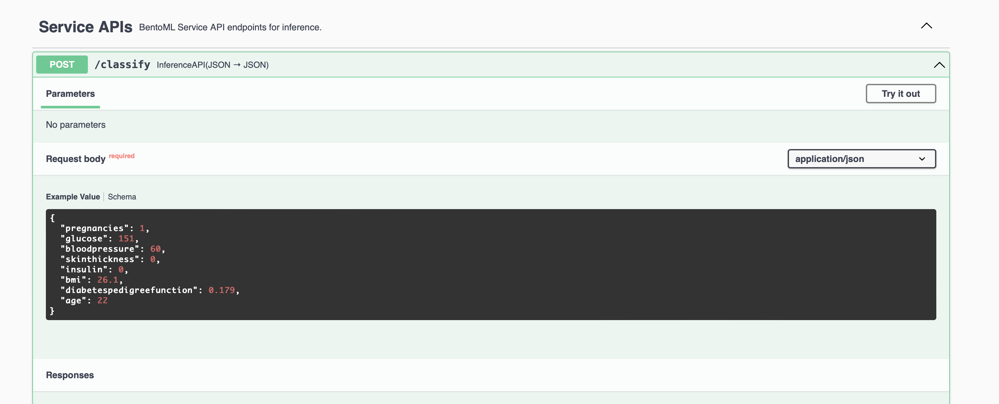

# Diabetes Prediction Service

### Problem Description
This project looks at providing a service that when given a specific set of attributes about a person, will provide an output of how at risk that person is of Diabetes.
This could be exposed via an api and accessed via medical software used by various health services to predict a persons risk of Diabetes and in turn intervene early and provide advice and resource to help the person improve their risk exposure.

The input features include:

````
Pregnancies: Number of times pregnant
Glucose: Plasma glucose concentration a 2 hours in an oral glucose tolerance test
BloodPressure: Diastolic blood pressure (mm Hg)
SkinThickness: Triceps skin fold thickness (mm)
Insulin: 2-Hour serum insulin (mu U/ml)
BMI: Body mass index (weight in kg/(height in m)^2)
DiabetesPedigreeFunction: Diabetes pedigree function
Age: Age (years)
````

### Data Source

The data was accessed via kaggle, <a source='https://www.kaggle.com/datasets/mathchi/diabetes-data-set'>https://www.kaggle.com/datasets/mathchi/diabetes-data-set</a>. The dataset consists of  768 records of patients data, 8 features + target.


### Train The Model
1. In the project root directory run ```pipenv shell```
2. Run ```Python training.py```

### Build with Bento, containerize and run locally
1. In the project directory, run ```bentoml build```
2. Containerize the model by running ```containerize diabetes_risk_classifier:latest```
2. Run the docker container (replace {containerId} with the id of the container from the above command)```docker run -it --rm -p 3000:3000 diabetes_risk_classifier:{containerId} serve --production```

### Serverless hosting
The model has been deployed as an AWS Lambda function using BentoCTL and can be accessed and tested via this url https://55o8hy6s63.execute-api.ap-southeast-2.amazonaws.com/#/Service%20APIs/diabetes_risk_classifier__classify

Steps taken to host serverless (Assumes you have installed bentoctl, terraform and aws-cli installed):
1. In the project directory, run ```bentoml build```
2. Change into deployment directory ```mkdir deploymnet && cd deployment```
3. Run ```bentoctl build -b diabetes_risk_classifier:latest -f deployment_config.yaml```
4. Run ```terraform init```
5. Run ```terraform apply -var-file=bentoctl.tfvars -auto-approve```
### Exploratory Data Analysis and Model Comparison
See training.ipynb


### testing
Load the api locally or via cloud link. Click the classify post endpoint, then click execute with the prepopulated test data. shown below

